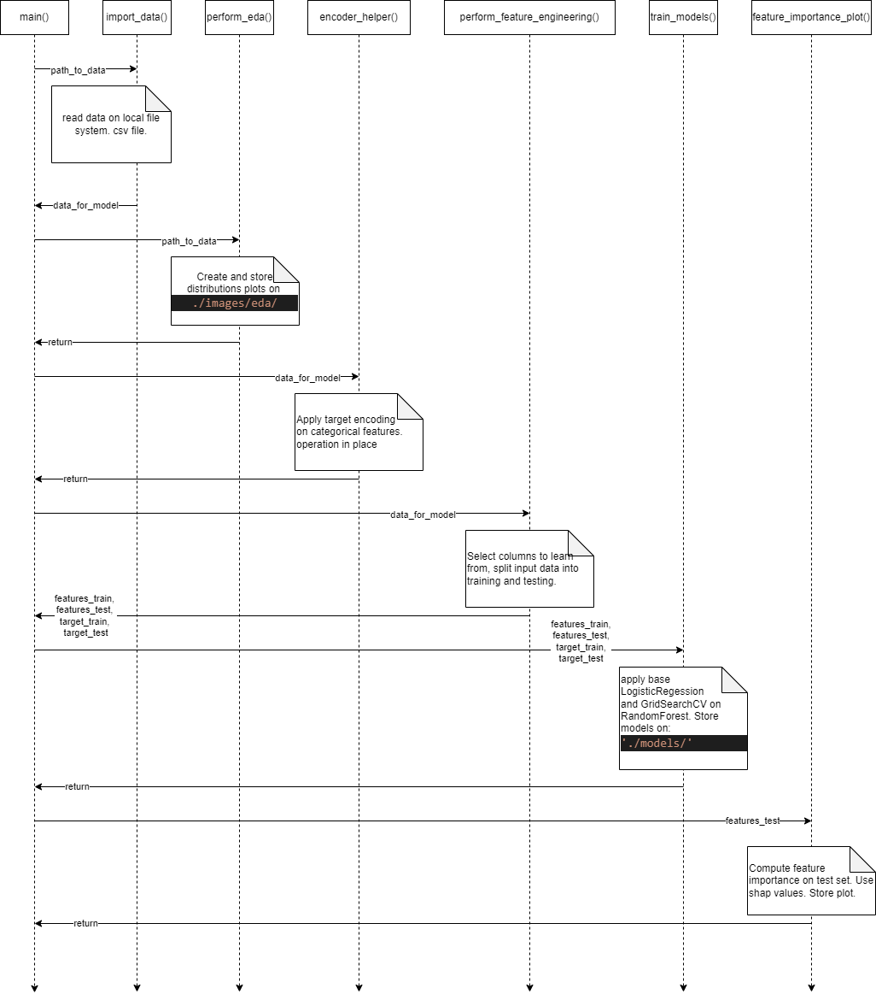

# Practicing clean code principles. 

+ **Task:** Refactor `churn_notebook.ipynb` into production level code. The notebook solves the problem *identify credit card customers that are most likely to churn. (Attrition_Flag-target)* 
The data comes from [kaggle](https://www.kaggle.com/datasets/sakshigoyal7/credit-card-customers/code).

|   CLIENTNUM | Attrition_Flag    |   Customer_Age | Gender   |   Dependent_count | Education_Level   | Marital_Status   | Income_Category   |
|------------:|:------------------|---------------:|:---------|------------------:|:------------------|:-----------------|:------------------|
|   768805383 | Existing Customer |             45 | M        |                 3 | High School       | Married          | $60K - $80K       |
|   818770008 | Existing Customer |             49 | F        |                 5 | Graduate          | Single           | Less than $40K    |
|   713982108 | Existing Customer |             51 | M        |                 3 | Graduate          | Married          | $80K - $120K      |
|   769911858 | Existing Customer |             40 | F        |                 4 | High School       | Unknown          | Less than $40K    |
|   709106358 | Existing Customer |             40 | M        |                 3 | Uneducated        | Married          | $60K - $80K       |

## Sequence diagram of `churn_library.py`

+ At at a high level, the `churn_library.py` file, produces distributions on age, churn, marital_status, total transtactions, as well as correlation matrix. The categorical features are *target encoded*. After this, two models are trained, a LogisticRegression(baseline) and RandomForestClassifier(Grid search). Those models are serialized to pickles for later use. Finally, feature importance on the test-set is computed using *shap-values*.



### Features
```
CATEGORICAL_FEATURES = [
    'Gender',
    'Education_Level',
    'Marital_Status',
    'Income_Category',
    'Card_Category'
]

NUMERICAL_FEATURES = [
    'Customer_Age',
    'Dependent_count', 
    'Months_on_book',
    'Total_Relationship_Count', 
    'Months_Inactive_12_mon',
    'Contacts_Count_12_mon', 
    'Credit_Limit', 
    'Total_Revolving_Bal',
    'Avg_Open_To_Buy', 
    'Total_Amt_Chng_Q4_Q1', 
    'Total_Trans_Amt',
    'Total_Trans_Ct', 
    'Total_Ct_Chng_Q4_Q1', 
    'Avg_Utilization_Ratio'
]
```
### Sample marital status distribution (EDA):


### Sample classification report:


### Sample feature_importance_sample:


## Principles of production ready code.
+ Clean and modular code, DRY principle.
+ Optimizing code for efficiency.
+ Writing documentation.
+ Follow PEP8 standards.
+ Readable, simple, concise.

## Folder structure.
+ This folder snapshot is after one execution.
```
C:.
│   .gitignore
│   churn_library.py
│   churn_notebook.ipynb
│   churn_script_logging_and_tests.py
│   constants.py
│   LICENSE
│   README.md
│   requirements_py3.8.txt
│
├───data
│       bank_data.csv
│
├───images
│   │
│   ├───eda (outputs)
│   │       age_distribution.png
│   │       churn_distribution.png
│   │       correlation_matrix.png
│   │       marital_status_distribution.png
│   │       total_trans_ct.png
│   │
│   ├───feature_importance (outputs)
│   │       feature_importance.png
│   │
│   └───results (outputs)
│           classification_report_logistic_regression.png
│           classification_report_random_forest.png
│
├───logs (outputs)
│       churn_library.log
│
├───models (outputs)
│       LogisticRegression.pkl
│       RandomForest.pkl
```

+ on `churn_library.py` we have the refactor code.
+ on `churn_script_logging_and_tests.py` we have a test execution with logging (`logs\churn_library.log`). No testing framework was used.

## Installation and use.
+ `pip install -r  .\requirements_py3.8.txt`
+ You can set a test run from terminal with `python churn_script_logging_and_tests.py`. This will clean project´s artifacts from images, models and logs folder; then perform a test run similar to the sequence image of above, with the addition of exception handling and logging. The test consist mainly on checking that the expected files are written to file system, e.g. images and models. The test will read parameters of execution from `constants.py`.
+ Once you make sure everything is working, you can run from terminal `python churn_library.py path_to_any_csv` to run an execution with *main*.